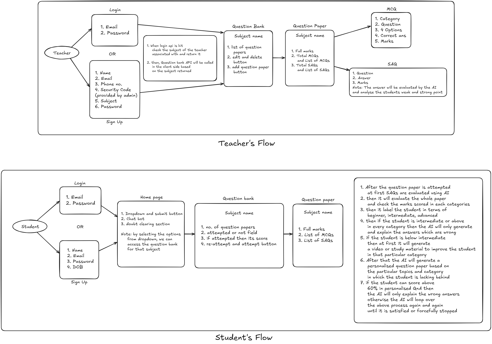

# Smartprep

## Step-by-Step Workflow for AI-Powered Personalized Test Portal

This structured workflow outlines how your project will function, from teacher test creation to AI-driven learning recommendations and chatbot assistance.

## Workflow Diagram

---

## Step 1: Teacher Creates Tests

- Teachers log in to the portal.
- They create a test with different question types:
  - _Descriptive Questions_ (students type or upload PDFs).
  - _MCQs_ (auto-graded).
  - _Code-Based Questions_ (if applicable).
- Teachers _set deadlines_ and _assign to specific student groups_.

---

## Step 2: Students Attempt Tests

- Students log in and access assigned questions.
- They respond in _three ways_:
  1. _Type answers_ in a text box.
  2. _Upload a PDF_ containing handwritten/detailed solutions.
  3. _Select answers for MCQs_.
- The system _autosaves progress_ to avoid data loss.

---

## Step 3: AI Evaluates Submissions Automatically

- _MCQs_: Instant grading via _predefined correct answers_.
- _Descriptive Answers_:
  - _NLP model_ (BERT, GPT, or custom AI) checks grammar, keywords, and concept accuracy.
  - AI assigns scores based on _clarity, correctness, and depth of explanation_.
- _Code-Based Questions_ (if applicable):
  - The system compiles & runs test cases to verify correctness.
- Students receive _instant feedback and scores_.

---

## Step 4: AI Categorizes Students into Cognitive Skill Groups

AI assesses student responses and classifies them into _three cognitive skill groups_:

1. _Logical Thinking_ (Problem-solving, deduction)
2. _Analytical Thinking_ (Data interpretation, reasoning)
3. _Memory-Based Learning_ (Retention, recall, factual knowledge)

Each student is further classified into _three proficiency levels_ per skill:

- _Noob_ (Beginner)
- _Intermediate_
- _Advanced_

---

## Step 5: AI Generates Personalized Follow-up Questions

- If a student _performs poorly_ in any skill area, the system:
  - _Generates additional practice questions_ for that topic.
  - Ensures the new questions _target the weak areas_.
- Example: If a student struggles with _logical reasoning_, AI provides more _logical puzzles and problem-solving questions_.

---

## Step 6: AI Recommends Study Materials (Text & Video)

- If a student _continues to struggle_, AI _suggests_:
  - _Text-based explanations_ (summarized concepts, articles).
  - _Video tutorials_ (YouTube API, instructor-uploaded content).
- The system _tracks improvement_ and updates recommendations dynamically.

---

## Step 7: AI Chatbot Provides Real-Time Learning Assistance

- Students can interact with the _AI-powered chatbot_ to:
  - Get _explanations_ for incorrect answers.
  - Receive _hints_ for tough questions.
  - Ask for _similar practice questions_.
  - Get _study tips_ based on progress tracking.

---

## Step 8: Progress Tracking & Reports for Students & Teachers

- Students can _view their performance history_:
  - Scores & feedback on past tests.
  - Skill progression over time.
- Teachers receive _detailed analytics_:
  - Student performance breakdown.
  - Class-wide skill distribution (logical, analytical, memory-based).
  - Suggestions to _improve teaching methods_.

---

## Summary of How the System Works

1. _Teachers create tests_ → Students submit answers.
2. _AI evaluates answers & assigns scores_.
3. _AI categorizes students into cognitive skill levels_.
4. _If weak in an area, AI generates personalized questions_.
5. _If struggle continues, AI suggests study materials (text & video)_.
6. _Chatbot assists in real-time for explanations & practice_.
7. _Student & teacher dashboards track progress & improvement_.

---

## 🚀 Technologies Used

| Component             | Tech Stack                          |
| --------------------- | ----------------------------------- |
| Backend               | Spring Boot (Java), Postgres        |
| Frontend              | Flutter (for mobile & web UI), Dart |
| AI for Evaluation     | Agno, Gemma, Llama                  |
| AI for Categorization | Machine Learning Classification     |
| AI Chatbot            | Groq Cloud                          |
| Video Recommendations | YouTube API, Firebase               |
| Cloud Storage         | Firebase/AWS (for PDFs & videos)    |

---

## Future Scope

- **Multilingual Support**: Expanding the platform to support multiple regional and international languages, ensuring broader accessibility and inclusivity.
- **AI-Powered Virtual Tutors**: Integrating advanced AI virtual tutors for real-time, personalized mentoring and detailed explanations.
- **Gamified Learning Modules**: Incorporating gamification techniques such as quizzes, badges, and leaderboards to boost engagement and motivation.
- **Integration with Educational Institutions**: Collaborating with schools and universities to provide a seamless learning experience and enhance curriculum alignment.
- **Adaptive Exam Preparation**: Implementing AI-driven mock exams and predictive analytics to help students prepare for competitive exams with personalized study strategies.
- **Skill-Based Learning Paths**: Expanding the system to offer tailored pathways for developing technical and soft skills in addition to academic learning.
- **Offline Access**: Developing offline capabilities to ensure uninterrupted learning in regions with limited internet connectivity.
- **Enhanced Data Security**: Implementing advanced encryption and data protection protocols to ensure student privacy and secure information handling.
